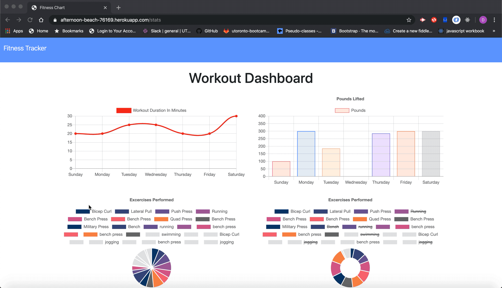

<h1> Fitness Tracker </h1>

<h3> User Story </h3>

  * As a user, I want to be able to view create and track daily workouts. I want to be able to log multiple exercises in a workout on a given day. I should also be able to track the name, type, weight, sets, reps, and duration of exercise. If the exercise is a cardio exercise, I should be able to track my distance traveled.

<h3> Description </h3>

 An application that allows the user track their workouts by creating new workouts, and adding to exisiting workouts. Also it gives the user an overview of the work out statistics. 

<h3> Technology Used </h3>

<ul>
  <li>
    <h4>
      Node JS
    </h4>
    

      Node.js will be need to run the application which is available to install from here.
		

    

			NPM will be required to all you to install the necessary packages to run the application.
     

  </li>
  <li>
   <h4>
     MongoDB
    </h4> 
    

      Mongo DB is the database that is used in this application, it is a non-relational database.
    

  </li>
  <li>
    <h4>
      Mongoose
    </h4>
    

      Mongoose is an ORM that is used to intergrate with the database.
    

  </li>
</ul>

<h3> 

<h3> Links </h3>

<h5>Repository:</h5> 
https://github.com/davidgeht/Fitness-Tracker

<h5>Heroku: </h5>

https://afternoon-beach-76169.herokuapp.com/

<h3>Using The Application </h3>

To start using the application click <a herf="https://afternoon-beach-76169.herokuapp.com/">HERE</a>

<h3>Preview</h3>

